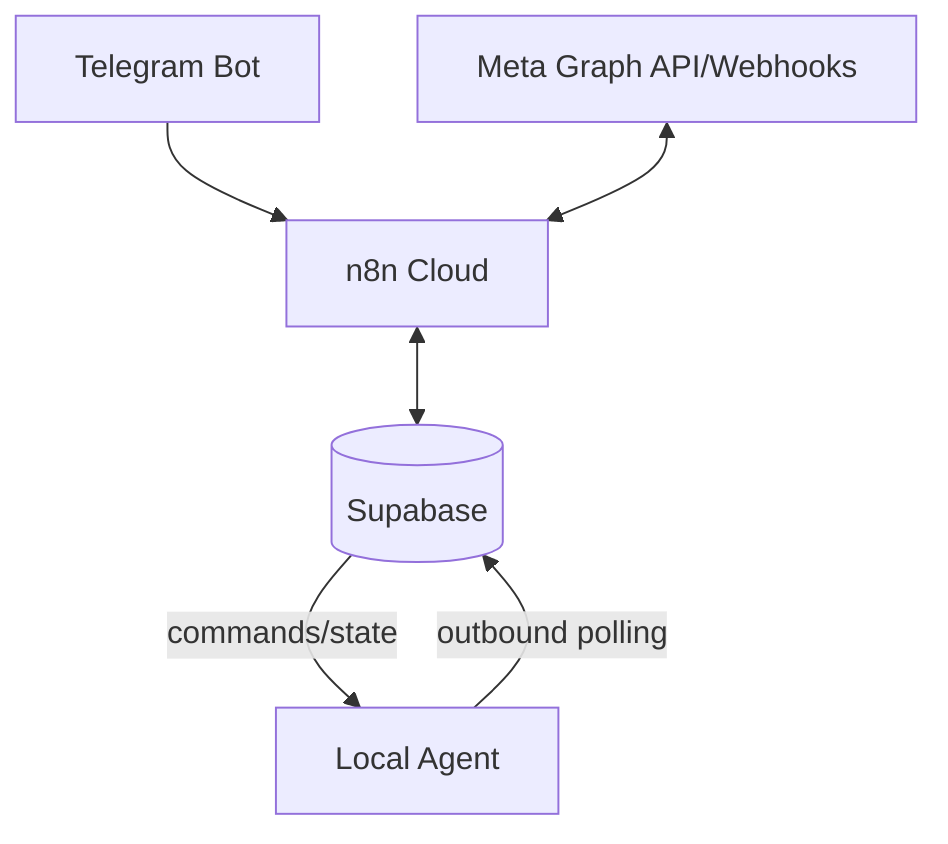

# Architecture

Supabase is the single source of truth. n8n orchestrates official API operations. The Local Agent has no public HTTP port and is limited to explicitly enabled browser tasks.

Neon Lakebase Postgres can replace Supabase PostgreSQL in a future deployment, but is not operated as a second synchronized state database in the MVP.
